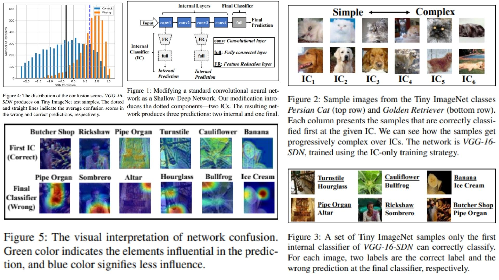

# 🌿 SDN Replication – Stacked Deep Networks for Fast Inference

This repository provides a **PyTorch-based replication** of  
**Stacked Deep Networks (SDN) – Accelerating Deep Networks with Internal Classifiers**.

The focus is **understanding early-exit branches and internal classifier supervision**,  
rather than purely maximizing benchmark accuracy.

- VGG-style backbone with **internal classifiers** ⚡  
- Early-exit supervision for **intermediate predictions** 🔹  
- Weighted combination for **final output** 🔸  
- Total loss combines ICs + final classifier objectives 📐  

**Paper reference:** [Stacked Deep Networks for Fast Inference](https://arxiv.org/pdf/1810.07052) 🔎

---

## 🌌 Overview – SDN Architecture



### 🚀 High-level Pipeline

1. **Input image**

```math
X \in \mathbb{R}^{C \times H \times W}
```

2. **Backbone (VGG / optional ResNet blocks)**

```math
F^{(m)} = f(W^{(m)} * F^{(m-1)}), \quad m=1..M
```

3. **Internal Classifier predictions**

```math
\hat{Y}^{(m)} = IC^{(m)}(F^{(m)}), \quad m=1..M
```

4. **Weighted combination for final output**

```math
\hat{Y}^{\text{final}} = g\Big(\sum_{m=1}^{M} w_m \hat{Y}^{(m)}\Big)
```

5. **Total objective**

```math
\mathcal{L}_{\text{total}} = \sum_{m=1}^{M} \alpha_m \mathcal{L}_{\text{IC}}(\hat{Y}^{(m)}, Y) 
+ \mathcal{L}_{\text{final}}(\hat{Y}^{\text{final}}, Y)
```

---

## 🧠 What the Model Learns

- **Backbone**: hierarchical feature extraction 🌱  
- **Internal Classifiers**: supervise intermediate layers → faster inference ⏩  
- **Early-exit mechanism**: allows adaptive computation based on confidence 🔹  
- **Final combination**: weighted sum of IC outputs for robust prediction 📘  
- **Losses**: IC loss + final classifier loss 💠  

---

## 📦 Repository Structure

```bash
SDN-Replication/
├── src/
│   ├── layers/
│   │   ├── conv_block.py          
│   │   ├── activation.py         
│   │   ├── normalization.py      
│   │   └── pooling.py             
│   │
│   ├── internal_classifiers/
│   │   └── ic_head.py                     
│   │
│   ├── backbone/
│   │   ├── vgg_blocks.py        
│   │   ├── resnet_blocks.py       
│   │   └── feature_maps.py        
│   │
│   ├── model/
│   │   └── sdn_net.py         
│   │
│   ├── loss/
│   │   ├── ic_loss.py           
│   │   ├── final_loss.py        
│   │   └── total_loss.py        
│   │
│   └── config.py                  
│
├── images/
│   └── figmix.jpg
│
├── requirements.txt
└── README.md

```

---

## 🔗 Feedback

For questions or feedback, contact: [barkin.adiguzel@gmail.com](mailto:barkin.adiguzel@gmail.com)
